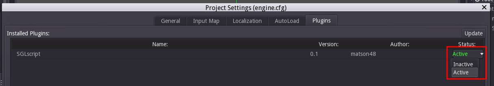

# SGLscript for Godot
 
SGLscript is a small scripting/markup language that originated in an unfinished Python game framework I made called [SGL](https://github.com/m48/sgl). This is an enhanced port of it to Godot. It is designed to provide a lightweight framework for implementing game cutscenes.

It is MIT licensed, like Godot.

## SGLscript Syntax
A typical block of the language looks like this:

```
[Label: name: "person"] ;; comment
	Line of dialogue #1

	Line of dialogue #2

	[Open door: ID: "front door" speed: 0.5]

	Line [shake screen] of dialogue #3

	This is \[not a command].
```

### Command syntax
Commands are in square braces. Command and argument names can have any characters you want in them, including spaces. (However, the default way in which commands are mapped to functions can only handle spaces and letters.) Commands can be placed anywhere, including in the middle of text.

Commands with no arguments consist only of the command name enclosed in square braces, like `[shake screen]`.

Commands with arguments consist of the command name, followed by a colon, then the arguments. Arguments consist of the argument name, followed by a colon, and then the argument value. Additional arguments are separated by whitespace.

Argument values can be numbers (`2`, `-3`, `0.5`...) or strings (`"hello there"`, `'hello there'`, `'"hi there," Bob\'s dogs said"). Numbers can be integers or floats. Strings can being enclosed in single or double quotes, as in Python. Backslashes can escape the other quote. They work like backslashes in the rest of SGLscript, so C escape sequences like "\n" will not work.

Strings can eschew quotes. When this happens, only a single word is considered part of the argument value, and it is converted to lowercase during parsing.

How many and which arguments are needed is completely up the function handling a given command. It is always okay to include more arguments than a command needs.

All parts of commands except for string literals are case and whitespace insensitive. `[Open door: ID: "front door" speed: 0.5]` and `[  open door:  id:   "front door" speed  : 0.5  ]` are parsed the same way. All command information is converted to lowercase during parsing.

Comments can be placed inside of commands.

### Special commands
`[no space]` removes whitespace on either side of its invocation. `AA   [no space] AA` produces `AAAA`. This command is stripped out by parsing.

`[label: name: "text"]` marks a label. The position of all label commands is recorded during parsing, so jumping between them as fast. Other than that, it is not treated specially.

`[paragraph]` is added during parsing after each block of text separated by a blank line. Providing a function to handle this command can let you make special logic happen at the end of each paragraph.

### Preprocessing
SGLscript has a few built-in commands to let users define simple syntax constructs.

`[define macro: old: "text" new: "text"]` defines a macro. Whenever the parser encounters the old text, it will replace it with the new text. Useful to automate typing long commands. This command is stripped out by parsing.

Will not be used if `do_macros` in [SGLscriptParser.gd](addons/SGLscript/SGLscriptParser.gd) is false.

`[define all caps header handler: command: "text" argument: "text"]` will turn first line of paragraphs into a command if it is in all caps. The name of this command is specified by the "command" argument, and the argument the contents of the line are sent to is specified by "argument". Useful to support a subset of [Fountain](http://fountain.io/) syntax. This command is stripped out by parsing.

Will not be used if `do_line_macros` in [SGLscriptParser.gd](addons/SGLscript/SGLscriptParser.gd) is false.

***Warning:** This will currently consider lines consisting of nothing but symbols as all caps, because of the way I worked around Godot's lack of an `is_upper` function. This will be fixed.*

### Other syntax
Comments begin with ";;". They last until the end of the line. There are no block comments.

"\" will escape the character after it, making it considered plain text. This is necessary to include "[" and ";;" in your dialogue. It can also prevent macros for being replaced. Standard C escape sequences will not work—"\n" will output "n".

Everything else is text that will be sent to text boxes. Your program can choose to ignore this text, though.

## Using SGLscript
To use SGLscript, include the `addons/SGLscript` folder in your project, either manually or through the Godot Asset Library.

***Warning:** If you're installing SGLscript from the Asset Library, and you've already started a project, make sure to check off "engine.cfg" when it asks you which SGLscript files you want to add. Installing from the Asset Library puts things directly in your project's root folder, so if that's left on, it will destroy all of your project's settings.

These settings are what the example scenes will run best in, though. You may want to make a separate project just to see the example scenes as they are intended.*

 
Then, in the editor, go to Scene -> Project Settings, go to the Plugin tab, and change the SGLscript plugin to "Active".

 
Now, when you go to add a node to your scene, "SGLscriptInterpreter" should be listed.

 
SGLscriptInterpreter has two exported properties:

* "Filename", which determines what SGLscript text file to load when the scene begins
* "Auto Start", which determines if the script should also be executed when the scene begins 

It is possible to do this all with GDscript—these properties are just to save time.

 
In order for SGLscriptInterpreter to do anything, it must have child nodes with scripts attached.

Whenever the interpreter encounters a command, it will look through its children for a function named "sgl_command_" followed by the command name with the spaces replaced by underscores. So, `[do thing]` would execute the function "sgl_command_do_thing". This function will be passed one argument—a dictionary containing the arguments to the SGL command. A typical command handler will look like this:

```gdscript
func sgl_command_paragraph(arguments):
     interpreter.pause(1)
```

Whenever the interpreter encounters text, it will look through its children for a function named "handle_text". This function will be passed one argument—the text to display or add to the current text box. A typical text handler will look like this:

```gdscript
func handle_text(text):
     dialogue.add_text(text)
```

The interpreter will search through its children from top to bottom and choose the first matching function it finds.

If either is not found, the interpreter will print an error message but continue as normal.

It is recommended for your scripts to save a reference to the interpreter node, so you can easily control the script flow. This is a quick way to do that:

```gdscript
onready var interpreter = get_node("../")
```

For more details, the examples should give you a better idea on the practical application of these concepts.

### SGLscriptInterpreter Properties
Currently, this just lists the properties that are recommended for you to use in your own programs. Things not listed may change.

**filename** (string)
The filename of the currently open script file. Set to "" if you load a script from a string. Also used _ready() to load the specified file at the beginning of the scene.

**auto_start** (boolean)
Whether to start executing any script as soon as it is loaded.

**index** (integer)
Which element of the script list the interpreter is currently on. To save the user's position in the script, you must save this value.

**paused** (boolean)
Whether the interpreter is currently paused or not.

**pause_code** (integer)
If the interpreter is paused, the reason for the pause. Set to -1 before any scripts are loaded, and to 0 during script execution.

**label_command** (SGLscriptParser.Command instance or null)
A reference to the command of the label the interpreter is currently inside. If you specify extra arguments in your labels, this could be used to retrieve extra metadata from them.

### SGLscriptInterpreter Methods
Currently, this just lists the methods that are recommended for you to use in your own programs. Things not listed may change.

**load_file(script_filename)**
Loads a script from the specified text file. If auto_start is true, will call advance() immediately afterwards.

**load_text(text)**
Same as load_file, but will load a script directly from a string instead. If auto_start is true, will call advance() immediately afterwards.

**advance()**
Starts/resumes script execution. Will keep executing commands on the same frame until something calls pause().

**pause(code)**
Pauses script execution. "code" determines what the interpreter's "pause_code" property is set to. This value can be read by other parts of your program to determine the reason for the pause.

**goto_label(label)**
Moves interpreter to the beginning of the label of the specified name. If the label name is specified does not exist, SGLscriptInterpreter will print an error message, but continue as if nothing unusual happened.


